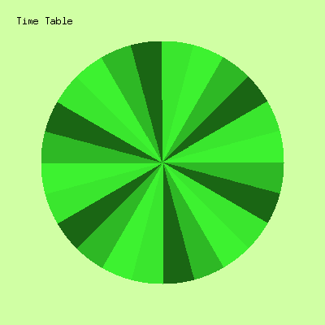

# timetable

Create daily pie chart image.

A Go program that creates pie chart images.

## Sample Output



## Requirements

* Go 1.17+

## Prerequisites

1. Download [Koruri-Regular.ttf](https://koruri.github.io/).
2. Place `Koruri-Regular.ttf` in the project root (same directory as `main.go`).

If it is missing, you may see:

```text
open Koruri-Regular.ttf: no such file or directory
```

## Usage

```sh
# Build
go build -o timetable .

# Run with default size (400×400) and default labels
./timetable

# Run with custom size
./timetable -w 600 -h 600

# Run with custom output file
./timetable -o output.png

# Run with custom labels (positional arguments)
./timetable "マイタイムテーブル" "朝" "昼" "夕" "夜"

# Combine flags and labels
./timetable -w 600 -h 600 -o custom.png "タイトル" "ラベル1" "ラベル2"
```

The output file `image.png` will be created in the current directory (unless `-o` is specified).

### Flags

| Flag | Default      | Description                                               |
|------|--------------|-----------------------------------------------------------|
| `-w` | `400`        | Image width (px)                                          |
| `-h` | `400`        | Image height (px)                                         |
| `-o` | `image.png`  | Output file path                                          |

### Labels

Any positional arguments after the flags are used as labels drawn on the image.
If no labels are provided, the defaults `["タイムテーブル", "Line1", "Line2", "Line3", "Line4"]` are used.

## Next

Change the implementation plan from self-made to existing.
Next repository is [kotaoue/pieimg](https://github.com/kotaoue/pieimg)

## References

* [Koruri](https://koruri.github.io/)
* [Adobe Color](https://color.adobe.com/ja/create/color-wheel)
* [mermaid](https://mermaid-js.github.io/mermaid/#/)
  * [Theme Configuration](https://mermaid-js.github.io/mermaid/#/theming)
